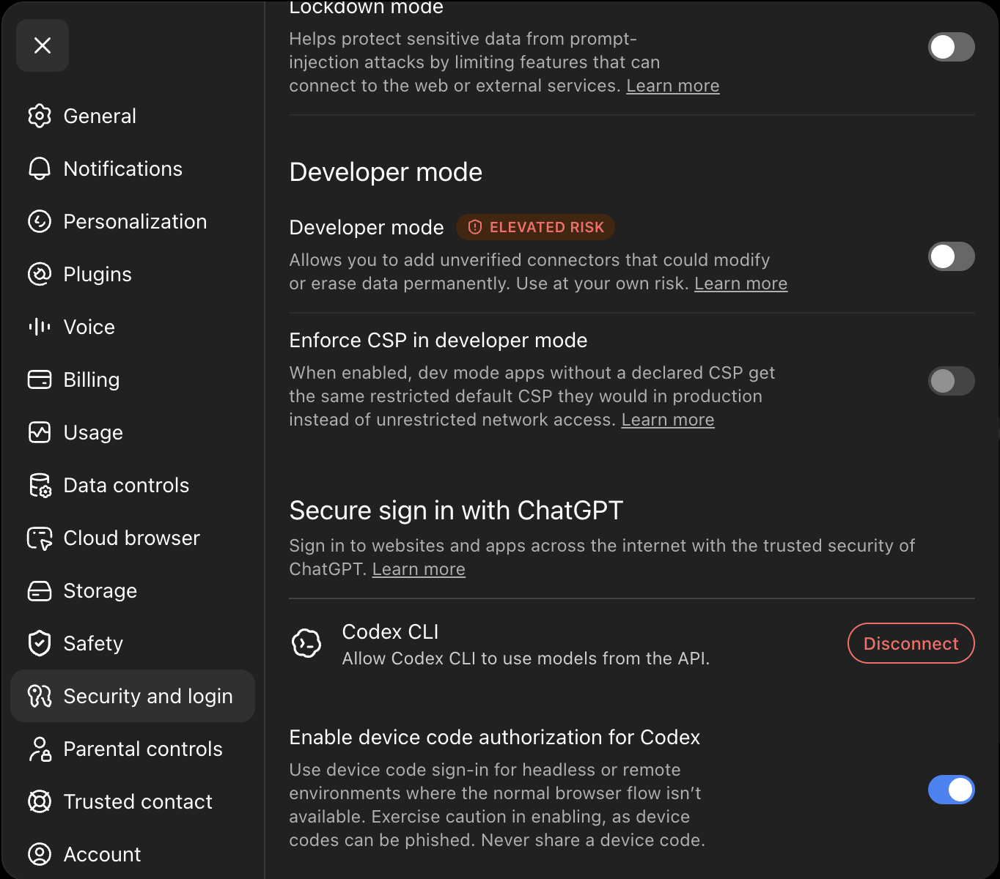
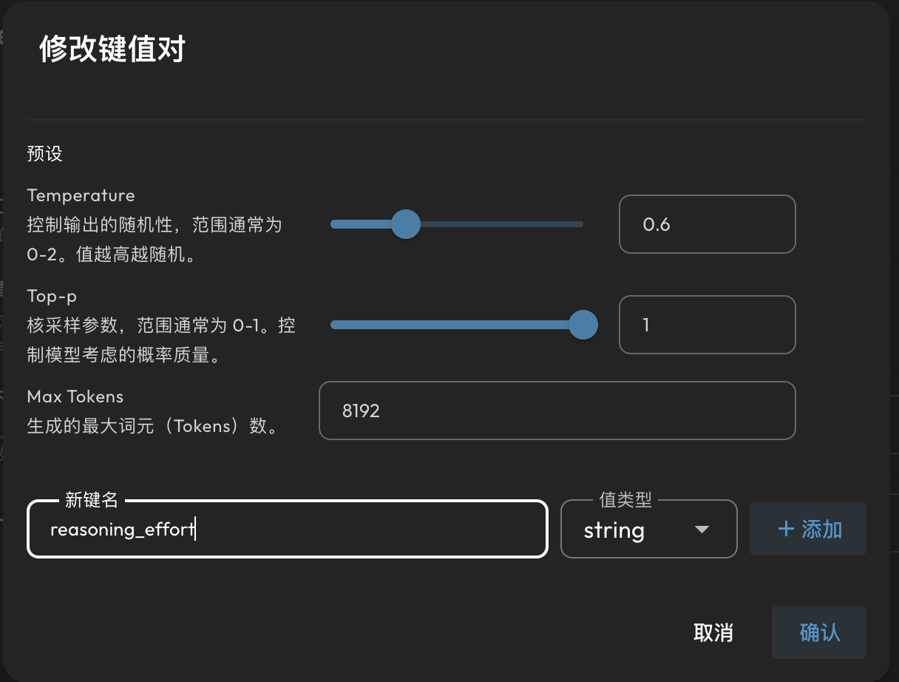
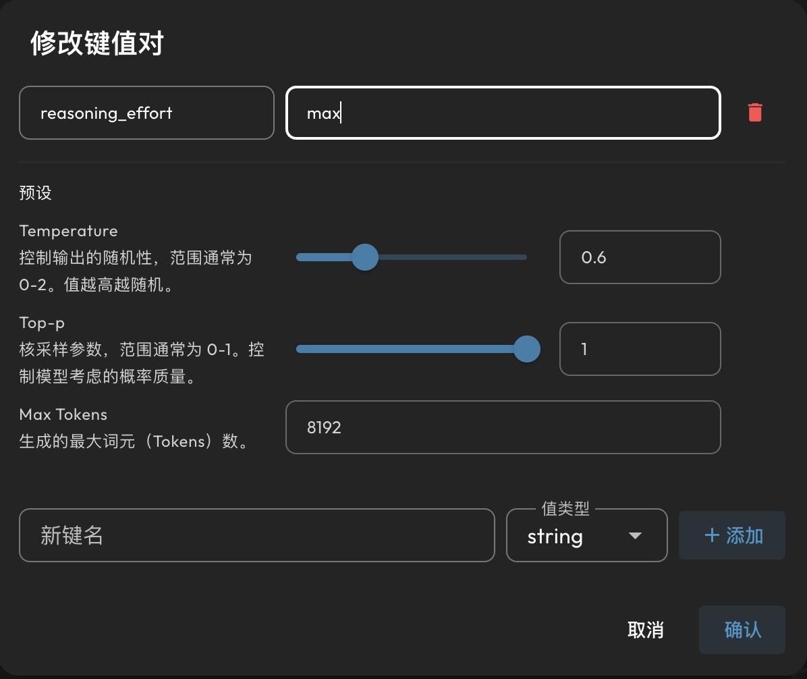

<h1 align="center">OpenAI 订阅登录</h1>

<p align="center">
  <a href="https://github.com/wcqqq1214/astrbot_plugin_openai_oauth/releases/tag/v1.0.0"></a>
  <a href="https://github.com/AstrBotDevs/AstrBot"></a>
  
  <a href="LICENSE"></a>
</p>

<p align="center">
  
</p>

<p align="center">
  <a href="README_en.md">English</a>
</p>

一个 [AstrBot](https://astrbot.app) 插件：用你的 ChatGPT 账号（Plus / Pro 订阅）登录，将账号订阅额度作为模型 provider 使用——无需 API Key。

它在 WebUI 模型配置中注册了一个 `OpenAI Subscribe` provider。AI 调用通过 OpenAI 的 Codex 后端（`chatgpt.com/backend-api/codex`）发出，使用设备码登录获取的 OAuth token，因此计费走你的**订阅额度**，而不是预付的 API 余额。

## 使用方法

1. 从 AstrBot 插件市场安装（或克隆到 `data/plugins/`）。
2. 在 WebUI 模型配置中添加一个类型为 **OpenAI Subscribe** 的 provider。
3. 登录你的 ChatGPT 账号。在 WebUI 插件详情页打开 AstrBot 原生 **Plugin Page**（登录页），点击 **开始登录**，复制页面显示的 OpenAI 验证网址并输入设备码完成授权。页面通过 Dashboard bridge 调用插件接口，不需要手动打开任何 `/api/v1/plugins/extensions/...` 地址；浏览器不会接触 Dashboard JWT、Cookie 或 access token / refresh token。登录成功后，服务端会把凭据自动写入 provider 的 `key` 字段。

   如果无法使用 WebUI，也可以在管理员的**私聊**中发送 `/openai_login`。该命令仅允许管理员使用，会及时发送 OpenAI 验证网址和一次性设备码，然后由 AstrBot 服务端后台轮询、交换并保存凭据；令牌不会发送到聊天。群聊中不会启动设备码流程。

   HTTPS/VPN/SSH 隧道仍然强烈建议用于整个公网 Dashboard，因为明文 HTTP 会暴露 Dashboard 会话。HTTPS 不是本插件设备码流程的强制条件：只要 AstrBot Dashboard 已经完成身份认证，公网 IP + HTTP 的 Plugin Page 也可以调用 `device/start` 和 `device/poll`；页面会显示风险警告。请优先为整个 Dashboard 配置 HTTPS 或安全隧道。

   > 需要在你的 ChatGPT 安全设置中开启设备码登录（“Enable device code authentication for Codex”）；未开启时页面会提示。

   

   *图：在 ChatGPT 的 **Security and login** 设置中开启 **Enable device code authorization for Codex**。*

4. 选择模型，并启用该 provider。

### 设置模型思考强度（可选）

在 WebUI 的模型配置中，打开 `OpenAI Subscribe` 下具体模型的编辑窗口，找到
`自定义请求体参数（custom_extra_body）`。在可视化编辑器中点击添加，填写：

- 键名：`reasoning_effort`
- 值类型：`string`
- 值：`low`、`medium`、`high`、`xhigh` 或 `max`

可视化编辑器示例：



*图 1：添加 `reasoning_effort` 键，并将值类型设为 `string`。*



*图 2：填写 API 参数值，例如 `max`。*

如果直接编辑底层 JSON，等价配置为：

```json
{
  "reasoning_effort": "max"
}
```

插件会把它转换为 Codex Responses API 的
`{"reasoning": {"effort": "max"}}`。对于 GPT-5.6 系列
（`gpt-5.6-luna`、`gpt-5.6-terra`、`gpt-5.6-sol`），已验证以下等级均可正常返回：

| WebUI 显示名称 | API 的 `reasoning_effort` 值 |
| --- | --- |
| Light | `low` |
| Medium | `medium` |
| High | `high` |
| Extra High | `xhigh` |
| Max | `max` |

API 参数应填写右列的值，不要直接填写 WebUI 显示名称。

## 网络与凭据流向

- 插件只与 OpenAI 官方域名通信：`auth.openai.com`（OAuth 设备登录、token 刷新）与 `chatgpt.com`（`backend-api/codex` 推理与模型列表、`backend-api/wham/usage` 额度查询）。访问令牌只出现在发给这两个域的请求头/请求体中，不会发往任何第三方。
- `proxy` 默认留空（直连），仅当你的网络无法直连 OpenAI 时才配置；配置后相关请求经该代理转发。`originator` 默认 `codex_cli_rs`，与官方 Codex CLI 一致（Cloudflare 对首方客户端白名单放行）；做成可配置是为了能跟随 OpenAI 后续接受的值，无需等待插件发版。
- Plugin Page 通过 AstrBot Dashboard bridge 调用 `device/start` / `device/poll`，只接受已认证的 WebUI 用户会话，不接受通用 API Key。设备会话与登录用户绑定、数量受限，并在完成或超时后清理。OAuth 凭据只在服务端交换和保存，不会返回浏览器。管理员私聊 `/openai_login` 使用同一套服务端设备码流程。登录后的凭据（access_token / refresh_token）保存在 provider 的 `key` 字段，落盘为 AstrBot 配置（`data/cmd_config.json`）中的明文；请限制该文件及备份的读取权限。
- 本项目是个人自用工具：用你自己的 ChatGPT 账号订阅额度（Codex OAuth）跑模型，不提供免费 API 途径。请自行确认你的使用方式符合 OpenAI 服务条款。

## License / 许可证

AGPL-3.0。
