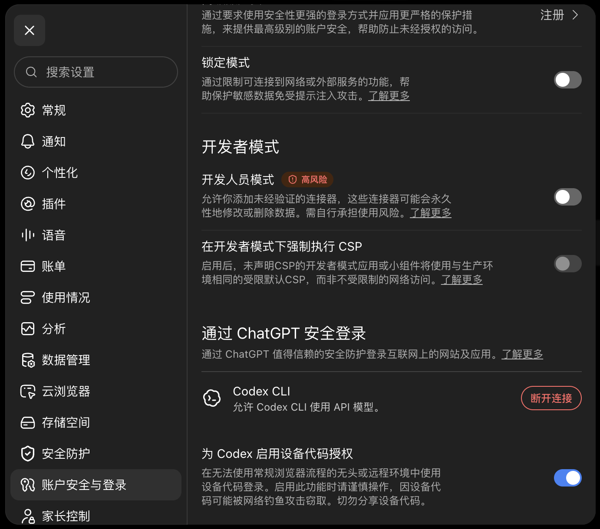
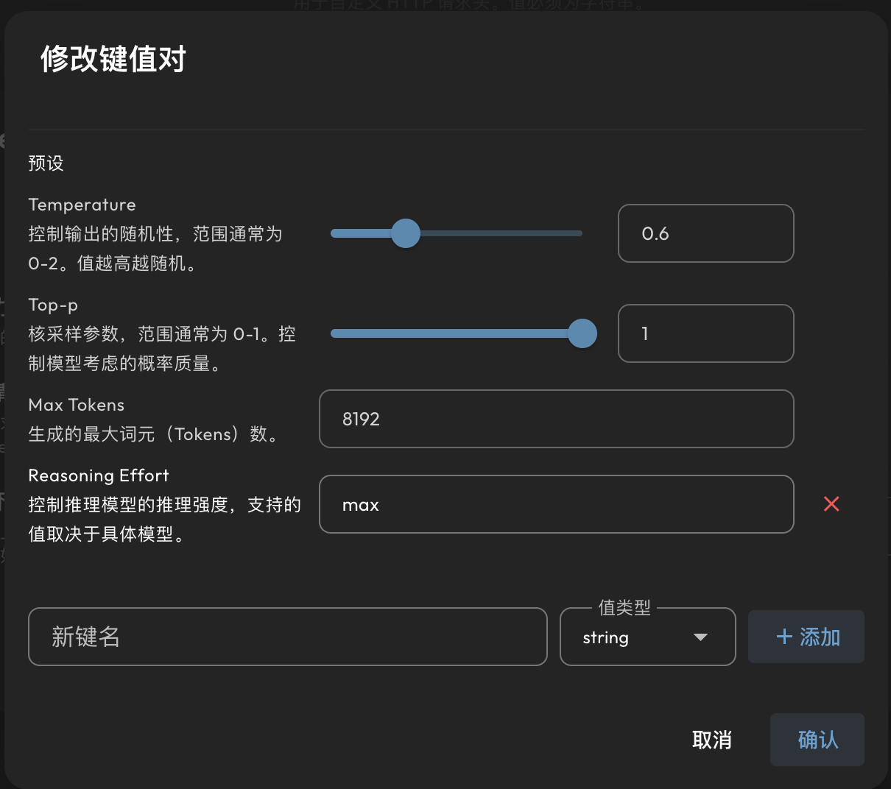

<h1 align="center">OpenAI 订阅登录</h1>

<p align="center">
  <a href="https://github.com/wcqqq1214/astrbot_plugin_openai_oauth/releases/tag/v1.2.0"></a>
  <a href="https://github.com/AstrBotDevs/AstrBot"></a>
  
  <a href="LICENSE"></a>
</p>

<p align="center">
  
</p>

<p align="center">
  <a href="README_en.md">English</a>
</p>

这个插件把你的 ChatGPT 账号接到 AstrBot 里。登录后，AstrBot 会多出一个
`OpenAI Subscribe` 模型来源；选择它的模型即可使用 ChatGPT/Codex 的额度，
不用另外创建或填写 OpenAI API Key。

简单说：这里消耗的是 ChatGPT 账号可用的 Codex 额度，不是 OpenAI API 预付余额。

## 开始前，先确认这几件事

- AstrBot 版本需要为 `4.27.1` 或更高。
- 你需要一个可以使用 Codex 的 ChatGPT 账号。
- 如果 Dashboard 暴露在公网，请优先配置 HTTPS、VPN 或 SSH 隧道。明文 HTTP
  也能完成设备码登录，但 Dashboard 会话可能被窃取，不建议这样用。
- 打开 ChatGPT 的 **设置 → 账户安全与登录**，开启
  **为 Codex 启用设备代码授权**。



*图：在 ChatGPT 的 **设置 → 账户安全与登录** 中，打开
**为 Codex 启用设备代码授权**。*

> 设备码和密码一样敏感：只在 OpenAI 的验证页面输入，不要发给别人。

## 登录：按这几步做就行

1. 在 AstrBot 插件市场安装本插件；手动安装则把项目放进 `data/plugins/`。
2. 打开该插件的详情页，进入它的 **Plugin Page**（登录页），点击 **开始登录**。
3. 页面会给出一个 OpenAI 验证网址和一串设备码。打开该网址，登录你的 ChatGPT
   账号，然后输入设备码并确认授权。
4. 回到 AstrBot，等待页面显示“登录成功”。凭据只会保存在 AstrBot 服务端，不会显示在
   浏览器或聊天消息里。
5. 前往 AstrBot 的模型配置，使用 `OpenAI Subscribe` 这个模型来源新建或选择模型，
   启用后即可使用。

登录页还可以查看账号状态和订阅额度；设备码还在等待授权时，也可以点 **取消登录**。
登录后，在聊天中发送 `/usage` 也能查询额度。

如果暂时打不开 WebUI，管理员可以在与机器人的**私聊**中发送：

```text
/openai_login
```

机器人会回复验证网址和一次性设备码。请在私聊里完成它；群聊不会启动登录流程。

## 想调整模型的思考强度？（可选）

不设置也可以正常使用，模型会采用默认行为。AstrBot 的模型编辑器已经提供
**Reasoning Effort** 预设，不需要再手动新增 `reasoning_effort` 键。

1. 进入模型配置，编辑使用 `OpenAI Subscribe` 的那一个模型。
2. 找到 **自定义请求体参数（`custom_extra_body`）**。
3. 在 **Reasoning Effort** 输入框中填写想要的值，然后点击右下角 **确认** 保存。



*图：AstrBot 内置的 **Reasoning Effort** 预设。填写 `max` 后点击 **确认** 即可。*

本插件支持以下值，填写时请使用小写英文：

| WebUI 里常见的显示名 | 要填写的值 |
| --- | --- |
| Light | `low` |
| Medium | `medium` |
| High | `high` |
| Extra High | `xhigh` |
| Max | `max` |

请填写右侧的值，不要把左侧显示名直接填进去。插件会自动转换为 Codex 所需的请求格式。

### 只给当前会话调整思考强度

管理员可以在私聊或群聊的当前会话里使用：

```text
/effort
/effort low
/effort medium
/effort high
/effort xhigh
/effort max
/effort default
```

`/effort` 用来查看当前设置；指定一个值后，会在下一次请求时生效。
`/effort default` 会取消这次会话的覆盖，恢复模型配置里的默认值。它不会改动其他会话，
也不会改掉模型的全局配置。

## 网络、额度和安全

- 默认直连时，插件只会访问 OpenAI 的 `auth.openai.com` 和 `chatgpt.com`。登录、刷新凭据、获取模型、查询额度和调用模型都走这两个域名。
- 只有网络无法直连 OpenAI 时才需要填写插件的 `proxy`。如果 AstrBot 跑在 Docker 或云服务器，并使用已获授权的出站代理，请在 **AstrBot 容器**中同时设置 `HTTP_PROXY` 和 `HTTPS_PROXY`，插件自己的 `proxy` 留空即可；插件里填写的 `proxy` 优先级更高。
- 登录凭据不会返回到浏览器，也不会发到聊天里；但它会以明文保存到 AstrBot 的
  `data/cmd_config.json`。请限制这个文件及其备份的读取权限。
- 一个 `OpenAI Subscribe` 模型来源对应一个 ChatGPT 账号。达到额度时，页面会显示冷却和重置时间；插件不会自动轮换账号。
- 如果看到 `unsupported_country_region_territory`，表示 OpenAI 不接受当前部署出口网络或账号条件。插件无法绕过这个限制。

请使用你自己的账号，并确认使用方式符合 OpenAI 的服务条款。

## License / 许可证

AGPL-3.0。
